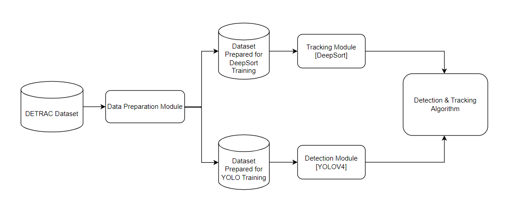

# Vehicle Detection and Tracking using DeepSort Algorithm and YOLOv4

This GitHub repository contains code for training and testing a vehicle detection and tracking system using DeepSort algorithm and YOLOv4 object detector. The repository provides step-by-step instructions on how to prepare the data, train the models, and test the models for vehicle detection and tracking.

## Modules Diagram 



## Getting Started

Please Make sure to clone this github repository directly in the home directory  

```bash
git clone https://github.com/Younes43/Vehicule_Detection_Tracking.git
```

The dataset used in this project is the DETRAC Dataset https://detrac-db.rit.albany.edu/download.

All the data is already downloaded and stored in the ~/data directory in the home directory

## Data Preparation

Please Reffer to this repository - [DETRAC Tools](https://github.com/LeonLok/Multi-Camera-Live-Object-Tracking/tree/master/detrac_tools) for detailed documentation on the data preparation for the DETRAC Dataset, And follow the commands bellow to prepare the dataset.


### DeepSort Data Preparation

1. Activate the virtual environment for YOLOv4 GPU.

```bash
conda activate yolov4-gpu
```

2. Navigate to the detrac_tools directory.
```bash
cd ~/Vehicule_Detection_Tracking/Multi-Camera-Live-Object-Tracking/detrac_tools
```
3. Run the crop_dataset.py script to prepare the DeepSort dataset.
```bash
python crop_dataset.py --DETRAC_images ../../../data/Insight-MVT_Annotation_Train/ --DETRAC_annots ../../../data/DETRAC-Train-Annotations-XML-v3/ --output_train ./Detrac_deepsort/bounding_box_train/ --occlusion_threshold=0.6 --truncation_threshold=0.6 --occurrences=50
```


### YOLOv4 Preparation

1. Navigate to the detrac_tools directory.
```bash
cd ~/Vehicule_Detection_Tracking/Multi-Camera-Live-Object-Tracking/detrac_tools
```
2. Run the detrac_to_yolo.py script to prepare the YOLOv4 dataset.
```bash
python detrac_to_yolo.py --DETRAC_images ../../../data/Insight-MVT_Annotation_Train/ --DETRAC_annots ../../../data/DETRAC-Train-Annotations-XML-v3/ --output_train DETRAC_YOLO_training/ --occlusion_threshold=0.6 --truncation_threshold=0.6
```
3. Copy the produced files into Yolo directory 
```bash
cp train.txt valid.txt detrac_classes.names DETRAC.data ~/Vehicule_Detection_Tracking/darknet/data/
cp yolov4-obj.cfg ~/data/yolov4.conv.137 ~/Vehicule_Detection_Tracking/darknet/cfg/
```


## DeepSort Training

Please Reffer to this repository - [DeepSort: Cosine Metric Learning](https://github.com/nwojke/cosine_metric_learning) for detailed documentation on DeepSort Training , And follow the commands bellow to train DeepSort Model.

1. Activate the virtual environment tf15-gpu

```bash
conda activate tf15-gpu
```

2. Navigate to the cosine_metric_learning directory.
```bash
cd ~/Vehicule_Detection_Tracking/cosine_metric_learning/
```
3. Run the train_market1501.py script to train the DeepSort model.
```bash
python train_market1501.py  --dataset_dir=../Multi-Camera-Live-Object-Tracking/detrac_tools/Detrac_deepsort/  --loss_mode=cosine-softmax  --log_dir=./output/Detrac/  --run_id=cosine-softmax
```
4. Open a new terminal and start TensorBoard for visualizing the training progress.
```bash
tensorboard --logdir ./output/Detrac/cosine-softmax/ --host=0.0.0.0 --port 6006
```
5. Open a web browser and go to http://localhost:6006/ to view the TensorBoard.


### DeepSort Model Evaluation
1. Open a new terminal and run the evaluation script for the DeepSort model.
```bash
CUDA_VISIBLE_DEVICES="" python train_market1501.py  --mode=eval  --dataset_dir=../Multi-Camera-Live-Object-Tracking/detrac_tools/Detrac_deepsort/  --loss_mode=cosine-softmax  --log_dir=./output/Detrac/  --run_id=cosine-softmax  --eval_log_dir=./eval_output/Detrac
```

2. Open a new terminal and start TensorBoard for visualizing the evaluation results.
```bash
tensorboard --logdir ./eval_output/Detrac/cosine-softmax/ --host=0.0.0.0 --port 6007
```
3. Open a web browser and go to http://localhost:6007/ to view the TensorBoard.


## DeepSort Model export

To export your trained model for use with the deep_sort tracker, run the following command and change model.ckpt-47054 to your latest checkpoint that you can find in output/Detrac/cosine-softmax/ :
```bash
python train_market1501.py --mode=freeze --restore_path=output/Detrac/cosine-softmax/model.ckpt-47054
```
This will create a detrac-deepsort.pb file which can be supplied to Deep SORT. 


## YOLOv4 Training

Please Reffer to this repository - [YOLOv4 Darknet](https://github.com/AlexeyAB/darknet)  for more detailed documentation on Yolov4 Darknet Training , And follow the commands bellow to train DeepSort Model.

4. Navigate to the darknet directory
```bash
cd ~/Vehicule_Detection_Tracking/darknet
```
5. Compile darknet by runing the following commands

```bash
make clean
rm -rf build_release
mkdir build_release
cd build_release
cmake ..
cmake --build . --target install --parallel 8
```

6. Launch the training of YOLOv4 using the command 
```bash
./darknet detector train data/DETRAC.data cfg/yolov4-obj.cfg cfg/yolov4.conv.137 -dont_show -mjpeg_port 8090 -map
```
7. On a browser open the url http://localhost:8090/ or http://127.0.0.1:8090/ to visualize the Loss Curve


## Testing yolov4+deepsort
1. Activate the virtual environment for YOLOv4 GPU.
```bash
conda activate yolov4-gpu
```

2. Convert darknet weights to tensorflow model

```bash
python save_model.py --model yolov4 --weights ../darknet/backup/yolov4-obj_best.weights --output ./checkpoints/yolov4
```

3. Run yolov4 deep sort object tracker on video
```bash
python object_tracker.py --video ./data/video/cars.mp4 --output ./outputs/cars_output.avi --yolo_weights ./checkpoints/yolov4 --deep_sort_weights ../cosine_metric_learning/detrac-deepsort.pb  --dont_show
```

4. You will find the ouptut video in ./outputs/ 

## Tracking and Detection Evaluation on Detrac Test Set

The Directory /evaluation contains scripts for preparing and runing the Evaluation 

1. Activate the virtual environment yolov4-gpu if it is not already done .
```bash
conda activate yolov4-gpu
```

2. Run yolov4 deepsort object tracker on a video from the test Set (In this Example we ran the evaluationon the video MVI_40712.mp4 you should change 'MVI_40712' to the name of the video you want to evaluate the model on )
```bash
python object_tracker.py --video ../evaluation/MVI_40712.mp4 --output ./outputs/MVI_40712_output.avi --output_file MVI_40712_output.csv --yolo_weights ./checkpoints/yolov4 --deep_sort_weights ../cosine_metric_learning/detrac-deepsort.pb  --dont_show 
```

You can Check visualy the resulting video in ./outputs/MVI_40712_output.avi  

3. Prepare the files we need for evaluation 

```bash
python prepare_evaluation.py --gt_xml MVI_40712.xml --gt_csv MVI_40712.csv --model_out ../yolov4-deepsort/MVI_40712_output.csv --model_out_filtered MVI_40712_output_filtered.csv
```
MVI_40712.xml is the annotation file for the video MVI_40712.mp4


4. Run the Evaluation 
```bash
python run_evaluation.py --gt MVI_40712.csv --pred MVI_40712_output_filtered.csv 
```

You should get a table result containing the following metrics :  


num_frames : Total Number of frames in the video  
Rcll : Recall  
Prcn : Precision  
GT : Total Ground truth objects  
FP : Number of False Positives  
FN : Number of False Negatives  
IDsw : Identity switches  
MOTA : Multi Object Tracking Accuracy  


## References and Credits

The following GitHub repositories were used in the development of this project:

- [DETRAC Tools](https://github.com/LeonLok/Multi-Camera-Live-Object-Tracking) by LeonLok
- [DeepSort: Cosine Metric Learning](https://github.com/nwojke/cosine_metric_learning) by Nwojke
- [YOLOv4 Darknet](https://github.com/AlexeyAB/darknet) by AlexeyAB
- [Yolov4 & Deepsort](https://github.com/theAIGuysCode/yolov4-deepsort) by Atwine


We would like to thank the authors of these repositories for their contributions to the field of computer vision and object tracking, which greatly aided the development of our project. 

Please refer to the respective repositories for more information and details on how to use their code. 


